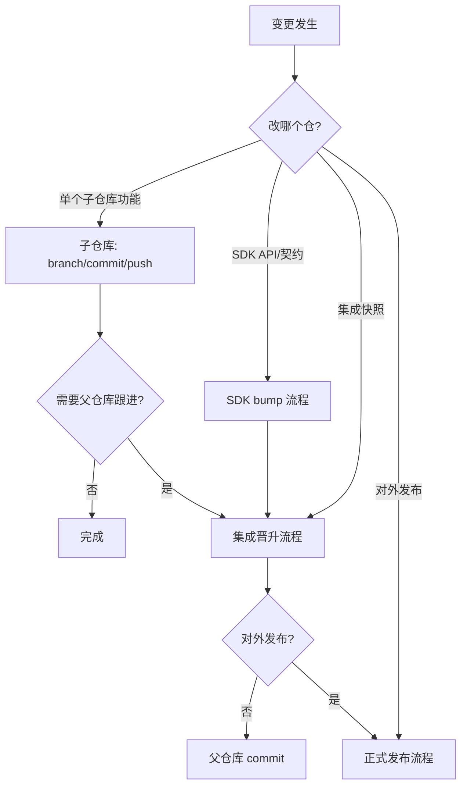

# Release Workflow

## Scope

- **父仓库** `satellite-workspace`：集成封套，**无独立 semver tag**；权威快照 = submodule gitlinks + `VERSIONS.lock`。
- **子仓库**（4 个 submodule）：各自独立 git 历史、commit、tag。

| 路径 | 远程仓库 | 角色 |
|------|----------|------|
| `sdk/` | satellite-plugin-sdk | 契约/SDK；含 `VERSION` 文件 |
| `task-manager/` | task-manager | 消费者 + 运行时 |
| `plugins/mission-planer/` | mission-planer | 插件消费者 |
| `plugins/image-preprocess/` | image-preprocess | 插件消费者 |

## Load When

- bump 版本、打 tag、同步 submodule
- 集成晋升或对外发布封板
- 询问 release / git-workflow / VERSIONS.lock 用法

## 决策树



详细 checklist 见 [references/checklists.md](references/checklists.md)。

## 子仓库 Git Workflow

- 在对应 submodule 目录内操作（`git -C sdk/ ...` 或 `cd sdk`）。
- 分支：跟随各子仓库默认主分支（`main`/`master`）；feature 分支从主分支拉出，PR 合并后进入集成。
- Commit：遵循 [commit-message-policy](../commit-message-policy/SKILL.md)（workspace 内子模块共用父仓库 `core.hooksPath`）。
- Push：**先 push 子仓库 remote，再改父仓库 gitlink**。
- Tag：对外可见版本在**子仓库**打 `vMAJOR.MINOR.PATCH`（见 [references/semver-and-tags.md](references/semver-and-tags.md)）。

## 两种 Lock 模式

| 模式 | 命令 | tag 要求 | 用途 |
|------|------|----------|------|
| Integration lock | `./scripts/update-lock.sh` | HEAD 有 exact tag 则用 tag；否则从 `VERSION` 推断 | 日常集成、CI |
| Release lock | `SATELLITE_RELEASE_LOCK=1 ./scripts/update-lock.sh` | **所有** submodule HEAD 必须是 exact tag | 对外发布封板 |

## 三条主流程

**A. 子仓库独立变更**：子仓库 commit → push →（可选）父仓库更新 gitlink + lock。

**B. SDK bump**（影响 consumer wrap）：更新 `sdk/VERSION` → sdk commit/tag/push → `update-lock.sh` → consumer 内 wrap 变更 commit → 父仓库 gitlink + lock。

**C. 集成晋升 / 正式发布**（6 步）：

1. 各子仓库 commit（release 时先打 tag 并 push tag）
2. 父仓库：`git submodule update` 或 checkout 到新 HEAD
3. `./scripts/update-lock.sh`（release 用 `SATELLITE_RELEASE_LOCK=1`）
4. 若 consumer `satellite-plugin-sdk.wrap` 被改动 → **在 consumer 子模块内单独 commit**
5. 父仓库 commit：gitlinks + `VERSIONS.lock`（+ 脚本变更若有）
6. 门禁（见下）

## 发布前门禁（Must Run）

```bash
./scripts/update-lock.sh   # 或 SATELLITE_RELEASE_LOCK=1 ./scripts/update-lock.sh
SATELLITE_STRICT_VERSIONS=1 ./scripts/check-versions.sh --strict
SATELLITE_STRICT_VERSIONS=1 ./scripts/build-all.sh
source install/env.sh && ./scripts/smoke-integration.sh
```

CI（`.github/workflows/integration.yml`）等价于 strict build + smoke；**永远不用** `SATELLITE_DEV_SDK=1`。

## Must Not

- 子模块 dirty 时运行 `update-lock.sh`（脚本会拒绝）
- 在 `SATELLITE_DEV_SDK=1` 本地联调后 commit lock / consumer `subprojects/` symlink
- 把 `subprojects/satellite-plugin-sdk/` 下载树提交进 git（只提交 `*.wrap`）
- 父仓库打 tag 作为产品版本

## Commit 联动

集成/发布类父仓库 commit 的 `version-check:` 段必须列出实际运行的门禁命令；格式见 [commit-message-policy](../commit-message-policy/SKILL.md)。

## References

- 仓库拓扑与操作顺序：[references/git-workflow.md](references/git-workflow.md)
- SemVer 与 tag 规则：[references/semver-and-tags.md](references/semver-and-tags.md)
- 可复制 checklist：[references/checklists.md](references/checklists.md)
