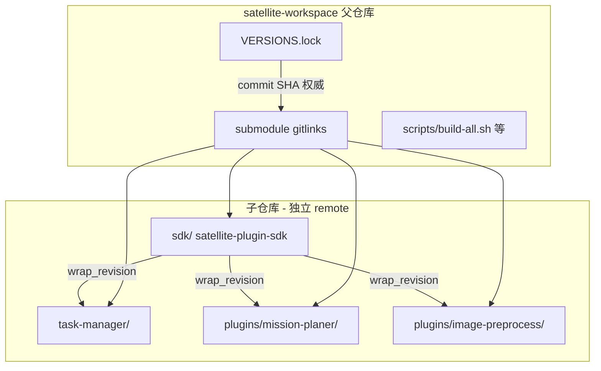

# Git Workflow Reference

## 仓库关系



## 权威版本来源

- **CI 可复现性以 commit SHA 为准**（`VERSIONS.lock` + gitlink）；tag 供人读。
- `check-versions.sh` 校验三项：
  1. 各 submodule `git rev-parse HEAD` == lock `commit`
  2. consumer `subprojects/satellite-plugin-sdk.wrap` 的 `revision` == lock `wrap_revision`
  3. `sdk/VERSION` == lock `version`
- 另校验 consumer `nlohmann_json.wrap` 的 `source_hash` == lock `wrap_hash`。

## 操作顺序约定

1. **先 push 子仓库，再改父仓库 gitlink** — 避免父仓库指向未推送的 commit。
2. **SDK 变更时**：
   - 在 `sdk/` commit + push（+ tag 若发布）
   - 父仓库 checkout sdk 到新 HEAD
   - `./scripts/update-lock.sh`（内部调用 `sync-wrap-revisions.sh`）
   - 在 `task-manager/`、`plugins/*/` 内 commit wrap 变更
   - 父仓库 commit gitlinks + `VERSIONS.lock`
3. **仅父仓库脚本/CI 变更**：父仓库直接 commit；若 gitlink 未变则无需 `update-lock.sh`。

## 父仓库 commit type 建议

| 场景 | type(scope) 示例 |
|------|------------------|
| 同步 lock / gitlink | `chore(lock,sdk)`、`chore(integration)` |
| 构建脚本 | `build(scripts)` |
| SDK 契约 breaking | `feat(sdk)`（在 sdk 子模块）；父仓库用 `chore(lock,sdk)` |
| CI | `ci(integration)` |

## 本地开发例外

```bash
SATELLITE_DEV_SDK=1 ./scripts/build-all.sh
```

- symlink `subprojects/satellite-plugin-sdk` → workspace `sdk/`
- 跳过 version check
- **仅本地使用**；不得 commit lock、wrap 或 symlink

安装 commit hook（父仓库 + workspace 内子模块）：

```bash
bash scripts/install_commit_msg_hook.sh
```

## Meson subprojects 政策

consumer 仓库 git 只 track：

- `subprojects/*.wrap`（含 `satellite-plugin-sdk.wrap` 的 url + revision）
- `subprojects/packagefiles/`（若有 overlay）
- `subprojects/README.md`（可选）

**不 track** 下载目录：`satellite-plugin-sdk/`、`nlohmann_json-*/`、`packagecache/` 等。由 `meson subprojects download` 重建。

标准 gitignore 片段见 `scripts/lib/subprojects.gitignore.snippet`。

## Submodule 初始化

```bash
./scripts/bootstrap.sh
# 等价于 git submodule update --init sdk task-manager plugins/mission-planer plugins/image-preprocess
```

CI 使用 `actions/checkout` + `submodules: recursive`，与本地 bootstrap 一致。
